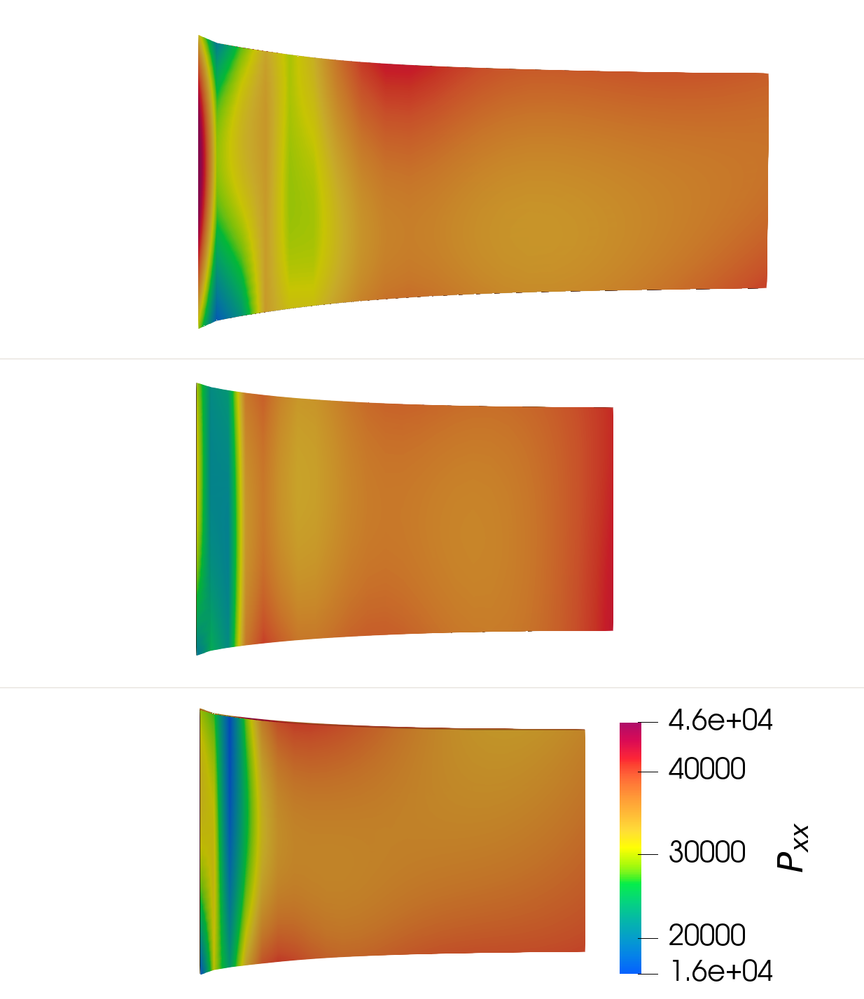
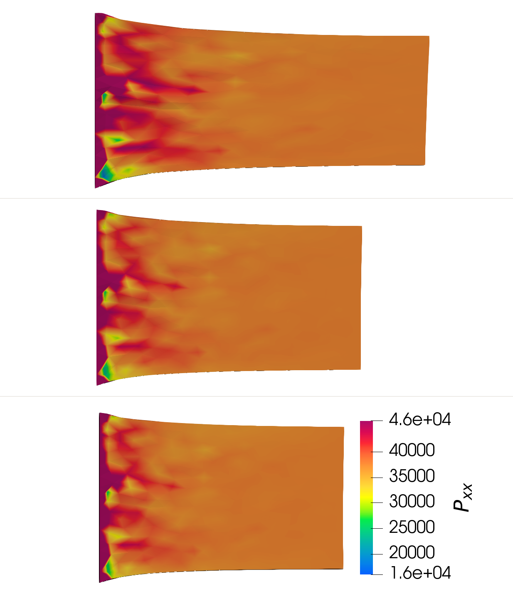

# Lagrange Energy Method (LEM) and Deep Energy Method(DEM) combined with the degraded elastic fiber constitutive model

## Constitutive model
The hyper-elastic constitutive model with degraded fibre feature is proposed for the aortic dessection research first.

### Basic notations in hyper-elasticity
In hyper-elasticity, there are some bascic notations which will be used in the constitutive model description.

The deformation tensor is evaluated as:
$$
\mathbf{F} = \frac{\partial \mathbf{x}}{\partial \mathbf{X}}
$$  
where $\mathbf{x}$ and $\mathbf{x}$ are the coordinates of the original and deformed configurations, respectively.

The right Cauchy–Green tensor follows:
$$
\mathbf{C} = \mathbf{F}^T \mathbf{F}
$$

The Green-Lagrangian strain tensor is evaluated as:  
$$
\mathbf{E} = \frac{1}{2} \left( \mathbf{C} - \mathbf{I} \right)
$$
It can be simplified to $\mathbf{E} = \frac{1}{2} \left( \mathbf{F} + \mathbf{F}^T \right) - \mathbf{I}$ if the infinitesimal strain assumption is applied. However, the deformation for soft tissues are generally large and can not be assumed as infinitesimal issue. So the classic Green-Lagrangian strain tensor is used in this work.

The volumetric strain can be evaluated as the determinant of the deformation tensor as: 
$$\epsilon_V = \det{\mathbf{F}}-1$$  
The material is assumed to be incompressible ($\epsilon_V \equiv 0$) so that the determinant of the deformation tensor should always be 1 ($J = \det{F} \equiv 1$);

Then the deformation tesnor is decoupled into a volumetric (dilatational) part $J$ and an isochoric (distortional) part:  
$$
\bar{\mathbf{F}} = J^{-{1}/{3}}\mathbf{F}
$$
where $\det{\bar{\mathbf{F}}} \equiv 1$ always holds. The modified counterpart of Cauchy-Green tensor is calculated as:  
$$
\bar{\mathbf{C}} = \bar{\mathbf{F}}^T \bar{\mathbf{F}}
$$

The first invariants of the and its counterpart are defined as:  
$$
I_1 = \mathrm{tr} \mathbf{C}, \quad \bar{I}_1 = \mathrm{tr} \bar{\mathbf{C}} 
$$

The fourth invariant is employed to consider the influence of the fibre direction. It is defined as:  
$$
I_4 = \mathbf{C} : \mathbf{N} \otimes \mathbf{N}, \quad \bar{I}_4 = \bar{\mathbf{C}} : \mathbf{N} \otimes \mathbf{N}
$$  
$I_4$ represents the suqared fiber stretch in direction $\mathbf{N}$, where $\mathbf{N}$ is defined in the original configuration and $\mathbf{n} = \mathbf{F} \mathbf{N}$ represents the related direction in current configuration. The direction vector in three dimension is defined as:  
$$
\mathbf{N} = \left [ \cos\phi \sin\theta, \sin \phi \sin \theta, \cos \theta \right ]^T, \quad \phi \in [0, \frac{\pi}{2}], \ \phi \in [0, 2\pi]
$$  
where $\phi$ is the azimuth angle and $\theta$ is the polar angle as is shown in following figure.  

|Fig Schematic of the angles used to define the fiber direction |
| :----: |
| |

### Strain energy function
A  strain-energy function $\Psi$ is introduced here to represent the elastic work with regard to the unit volume of the material. The strain energy can be decomposited into volumetric and isochoric part as:  
$$
\Psi = \Psi_{\mathrm{vol}} + \Psi_{\mathrm{iso}}
$$
where $\Psi_{\mathrm{vol}}$ and $\Psi_{\mathrm{iso}}$ represent the elastic work caused by volumetric deformation and distoration, respectively. The volumetric part is be evaluated as:  
$$
\Psi_{\mathrm{vol}} = \frac{K}{4} \left( J^2 -1 - 2 \ln{J} \right)
$$
where $K$ is the bulk modulus acting as a penalty to apply the incompressible constraint. The isochoric part consists of the ground substance $\Psi_{g}$ and the elastic fibers $\Psi_{e}$ (note: the part from collagen part is neglected for simplicity, as it is much smaller than the part from elastic fibers):  
$$
\Psi_{\mathrm{iso}} = \Psi_{g} + \Psi_{e}
$$
where the ground part is calculated as:  
$$
\Psi_{g} = \frac{\mu}{2} (\bar{I}_1 - 3)
$$
where $\mu$ is the shear modulus.

## Elastic fiber's with degraded feature
In the work of Li et al.(2017 )[1], a discrete fiber dispersion (DFD) model was introduced to formulate a strain–energy function which includes the dispersion of collagen fibers while excluding fibers under compression. Then in the Rolf-Pissarczyk's work (2018) [2], a degraded feature is proposed via introducing an extra health coefficient $\xi$.

#### Fibre integration
In the DFD model, the elastic work of the elastic fiber is integrated within the integration semi-sphere. The fiber integration can be shown on a semi-sphere model as following:
|Fig. 1 Fibre integration semi-sphere|
| :---: |
|  |

Weights on every single triangles are evaluated through:   
$$
\rho (\mathbf{N}_i ) = \frac{\exp{ \left [ -2 b_e( \mathbf{N}_i \cdot \mathbf{R})^2 \right ] } }{\sum_i  \exp{ \left [ -2 b_e( \mathbf{N}_i \cdot \mathbf{R})^2 \right ] } }, \quad \mathbf{N}_i \in \mathcal{S}
$$  
where $\mathcal{S}$ represents the semi-sphere surface, vector $\mathbf{R}$ represents the main direction of the fiber, vector $\mathbf{N}_i$ is the direction along which the weight is evaluated, and $b_e$ is the coefficient to adjust the density of the fiber in direction of $\mathbf{R}$, the larger $b_e$ is the denser fiber in the direction $\mathbf{R}$. Weights all over the semi-sphere will be the same if $b_e=0$. It is easy to derive $\sum_{\mathbf{N}_i \in \mathcal{S}} \rho(\mathbf{N}_i) \equiv 1 $.

The elastic work of the fibre is calculated as:
$$
\Psi(\mathbf{N}_i, \mathbf{C}) = \left\{\begin{aligned}
& f_{en}(\bar{I}_4)  & \mathrm{if}  \ \bar{I}_4>1 & \\ 
& 0 & \mathrm{else} &
\end{aligned}\right. 
$$  
where as interpreted, $\bar{I}_4$ is the squared stretch on direction $\mathrm{N}_i$. The elastic potential is positive unless the elastic fiber is compressed in this direction. In the following, $\Psi(\mathbf{N}_i, \mathbf{C})$ at an integration point will be marked as  $\Psi_i$ for simplicity. The fiber potential function used in this paper is:  
$$
f_{en}(\bar{I}_4) = \frac{c_1}{c_2} \left( \bar{I}_4 ^{c_2/2} -1 \right) - \frac{c_1}{2} * \ln{\bar{I}_4}
$$  
where $c_1$ and $c_2$ are material constants.

Given the deformation tensor $\mathbf{F}$, the elastic potential $\Psi_i$ will be evaluated in every single triangles on the semi-sphere and then summed up as following:   
$$
\Psi_e = \sum_i \Psi_i \rho_i
$$  
where $\rho_i = \rho(\mathrm{N_i})$ is the weights in direction $\mathrm{N_i}$.

#### Degraded feature of the elastic fiber
As described in Rolf-Pissarczyk's work [2], the potential integration further considered the health coefficient $\xi$ to complete the degraded fiber feature. The specific meaning of $\xi$ can be should as:  
$$
\xi = \left\{\begin{aligned} 
& 1 & \mathrm{Healthy} \\
& 0 \sim 1 & \mathrm{Partly damaged} \\ 
& 0 & \mathrm{Totally damaged} \\
\end{aligned} \right.
$$  

The elastic fiber potential will be counted only if the fiber is within the inverted cone whose polar angle is $\theta_n = \frac{\pi}{2} \xi$, as is shown in following figure. Thus, all of the elastic fiber will be counted with $\xi = 1$ while $\Psi_e=1$ when $\xi = 1$.

|Fig. Implementation of the degraded feature: fiber with the inverted cone will be counted while those out of the cone don't work |
| :---: |
|  |

After introducing $\xi$, the elastic fiber's potential $\Psi_i$ shown upon is changed to:  
$$
\Psi(\mathbf{N}_i, \mathbf{C}) = \left\{\begin{aligned}
& f_{en}(\bar{I}_4) & \mathrm{if}  \ \bar{I}_4>1 \ \mathrm{and}\  \theta_i< \frac{\pi}{2} \xi \\ 
& 0 & \mathrm{else} &
\end{aligned}\right. 
$$  
Then we can calculate the whole elastic potential at a material point with the material parameters and the deformation tensor supplied.
Then the first Piola-Kirchhhof stress can be derived as:  
$$
\mathrm{P} = \frac{\partial \Psi}{\partial \mathrm{F}}
$$  
The Cauchy stress tensor can be calculated as:  
$$
\boldsymbol{\sigma} = \frac{1}{J} \mathbf{P} \mathbf{F}^T
$$.

Within the classic FEM solver, especially when engaging the Newton-Ralphson nonlinear solver, the stress and material tangent matrix $\mathbf{D} = \frac{\partial \boldsymbol{\sigma} }{\partial \mathbf{\epsilon} } $ need to be manually derived to evaluate the node force matrix and stiffness matrix. 
While, there is no need to calculate the stress tensor and the tangent matrix in our method as the solving problem is shifted to an optimization problem. The object is to minimize the global potential $\Pi$, including internal elastic potential $\Pi_{\mathrm{int}}$ and work done by external loadings $\Pi_{\mathrm{ext}}$.

While, because of the work is built with the PyTorch library, the stress tensor can be easily evaluated through several lines of Python scripts facilitated by the auto-differentiation method in this library.

## DEM

The Deep Energy Method is first inspired by E Weinan's [1](https://arxiv.org/abs/1710.00211) -- the deep Ritz Method. They introduced deep learning to solve high-dimentional partial differential equations such as the Poisson's equation.
Nguyen-Thanh [1](https://www.sciencedirect.com/science/article/pii/S0997753819305352) introduced this method to finite deformation hyper-elasticity, named the method as Deep Energy Method (DEM).
Abuda [1](XXX) used further apply DEM to viscosity.
He junyuan  used this work to the domain of plasticity via adding plastic work into the loss function.

The DEM method can be depicted as following figure. **(add the distance function into the figure as a mask of the network output to apply the displacement constraints)**

|Fig. The schematic of DEM |
| :---: |
|  |

The displacement is predicted by the deep network:  
$$
\hat{\mathrm{u}} = \mathcal{NN}(\mathbf{X})
$$  
where $\mathbf{X}$ is the coordinates of the original configuration. Then the deformation tensor is calculated by the auto-differentiation. The internal potential is calculated as:  
$$
\Pi_{\mathrm{int}} = \int_{\Omega} \Psi(F) d\Omega
$$
and the extenal potenial is calculated as:  
$$
\Pi_{\mathrm{ext}} = \int_{\Omega} \mathbf{f}_b \cdot \hat{\mathbf{u}} d \Omega
 +  \int_{\Gamma_t} \mathbf{t} \cdot \hat{\mathbf{u}} d \Gamma
$$
where $\mathbf{f}_b$ is the body force, $\mathbf{t}$ is the traction on the boundary.

## LEM

**TODO MESH SENSITIVITY AND CONVERGENCE**

**Malte's opinions**

## Simulation results

### Orientation of the fibre direction
Here compared the results with different fiber directions.

| Fig DEM simulation results with different fibre orientations | Fig LEM simulation results with different fibre orientations |
| :---: | :---: |
|  |  |

### Different healh coefficients

| Fig DEM simulation results with different health coefficients ($0.2, 0.4, 0.6$ from top to bottom) | Fig LEM simulation results with different health coefficients ($0.2, 0.4, 0.6$ from top to bottom) |
| :---: | :---: |
|  |  |

### Curlve neural network

**Very interesting to add**

### Random field of health coeffcient

| Fig Comparison between DEM and LEM with different random field of health coefficients | Fig Comparison between DEM and LEM with different random field of health coefficients | Fig Comparison between DEM and LEM with different random field of health coefficients |
| :---: | :---: | :---: |
|  |  |  |

## Reference:
- [1] Rolf-Pissarczyk, M., Li, K., Fleischmann, D., & Holzapfel, G. A. (2021). A discrete approach for modeling degraded elastic fibers in aortic dissection. Computer Methods in Applied Mechanics and Engineering, 373, 113511. https://doi.org/10.1016/j.cma.2020.113511
- [2] Holzapfel, G. A., Gasser, T. C., & Ogden, R. W. (2000). A new constitutive framework for arterial wall mechanics and a comparative study of material models. Journal of Elasticity, 61(1–3), 1–48. https://doi.org/10.1023/A:1010835316564
- A New Constitutive Framework for Arterial Wall Mechanics and a Comparative Study of Material Models, https://link.springer.com/article/10.1023/A:1010835316564