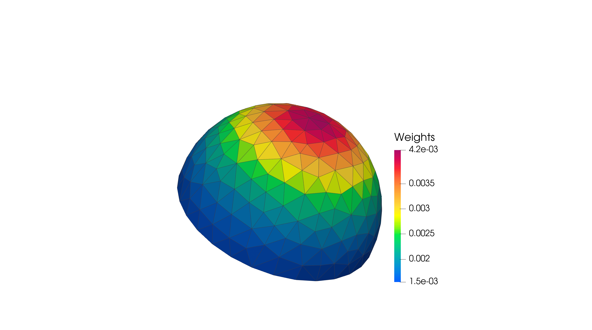
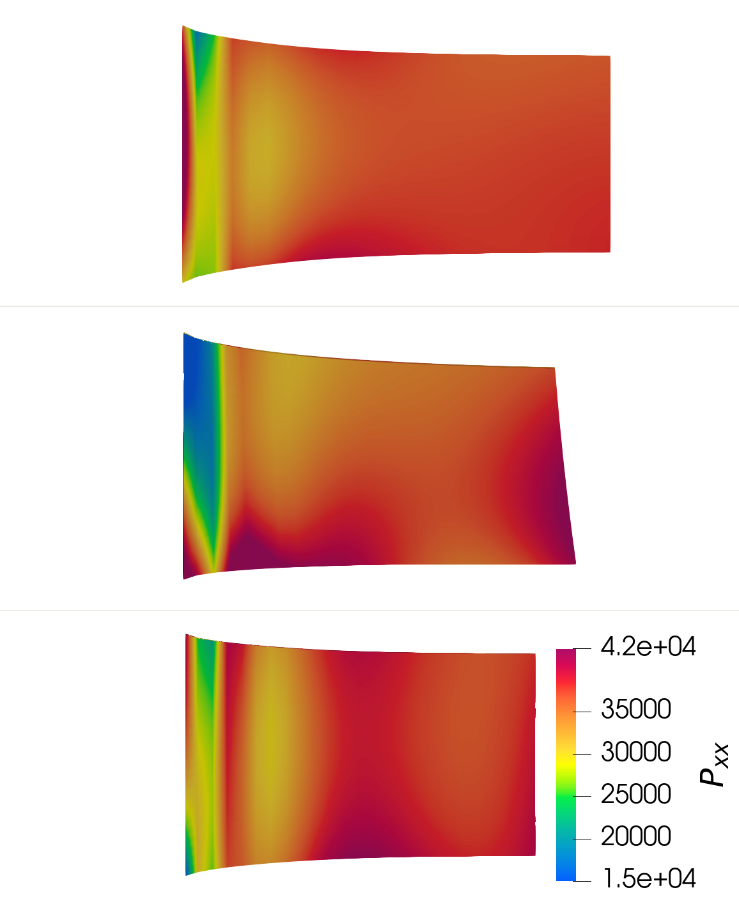
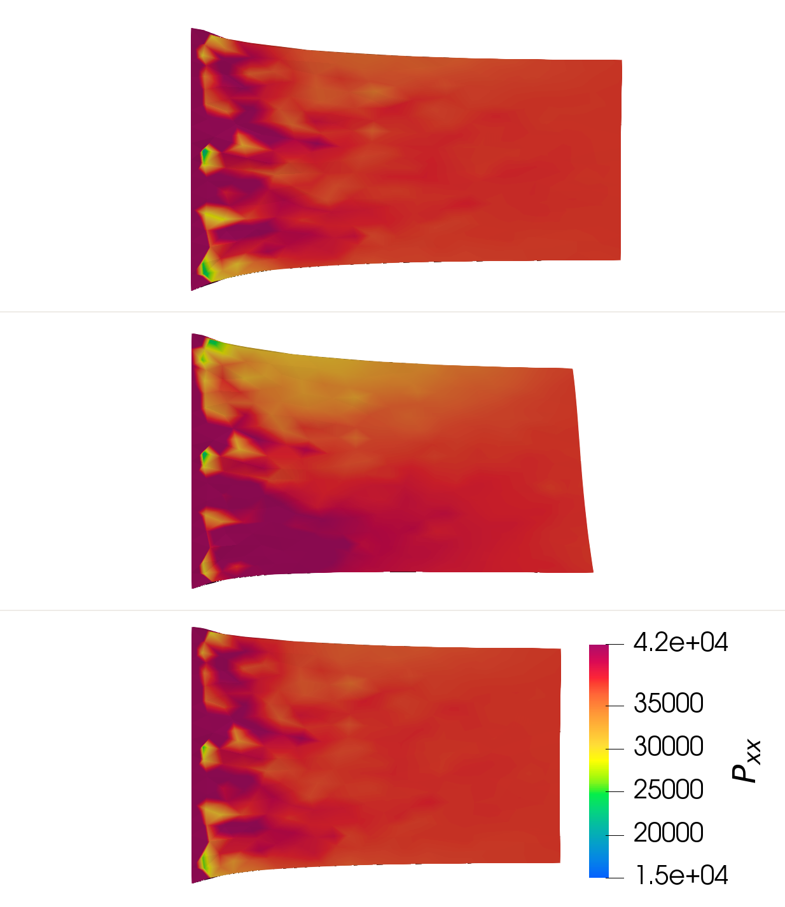
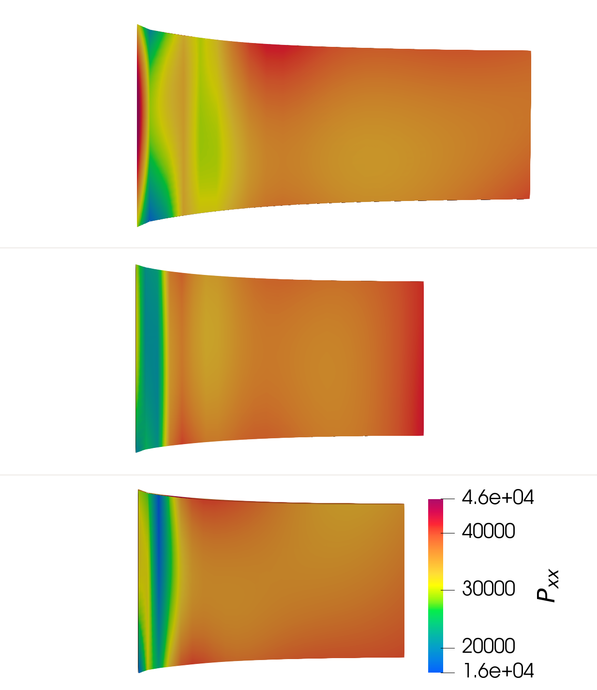
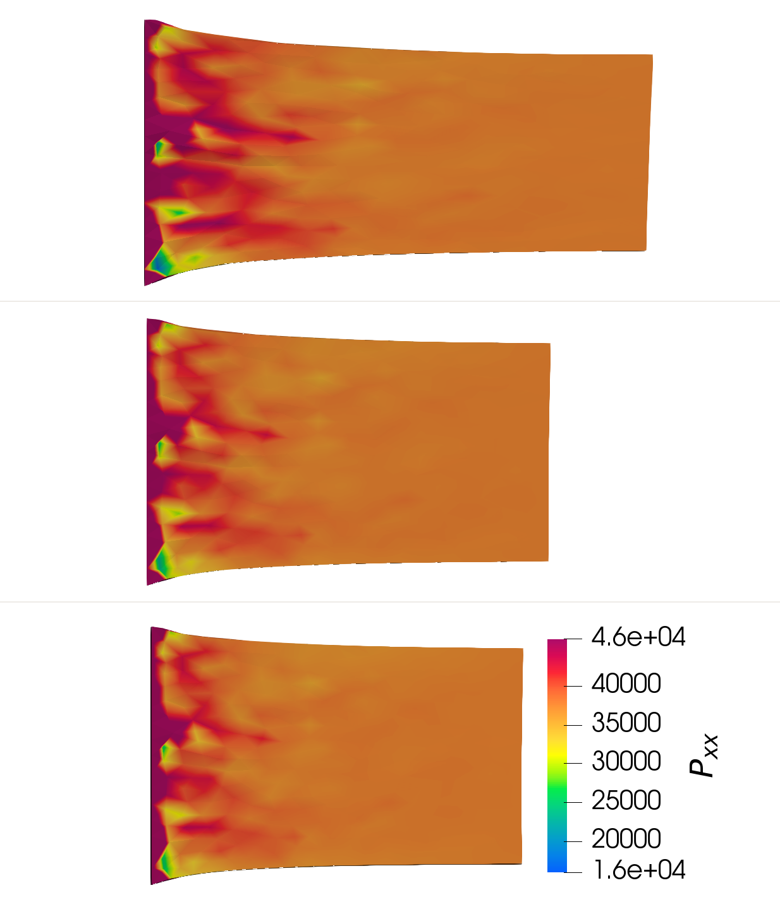
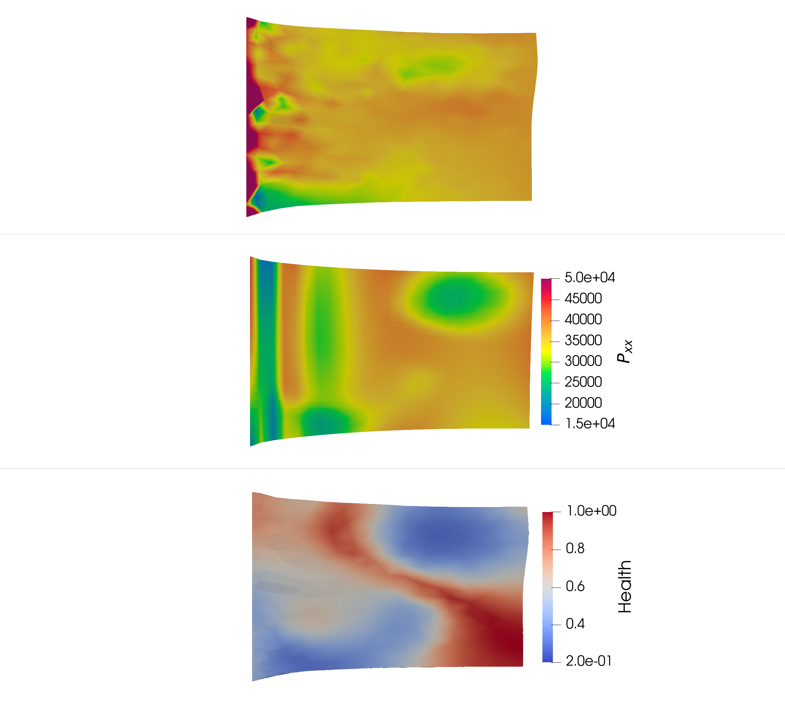
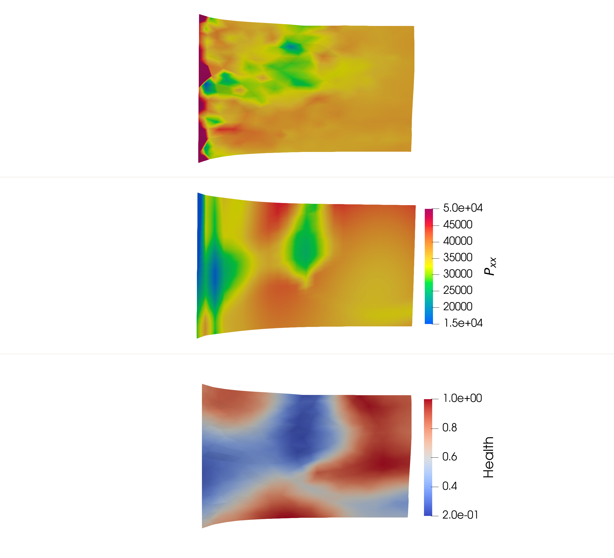
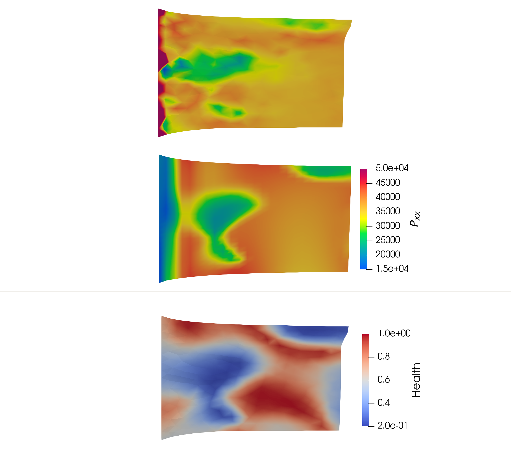

# Lagrange Energy Method (LEM) and Deep Energy Method(DEM) combined with the degraded elastic fiber constitutive model

## Constitutive model
The hyper-elastic constitutive model with degraded fibre feature is proposed for the aortic dessection research first.

### Basic notations in hyper-elasticity
In hyper-elasticity, there are some bascic notations which will be used in the constitutive model description.

The deformation tensor is evaluated as:
$$
\mathbf{F} = \frac{\partial \mathbf{x}}{\partial \mathbf{X}}
$$  
where $\mathbf{x}$ and $\mathbf{x}$ are the coordinates of the original and deformed configurations, respectively.

The right Cauchy–Green tensor follows:
$$
\mathbf{C} = \mathbf{F}^T \mathbf{F}
$$

The Green-Lagrangian strain tensor is evaluated as:  
$$
\mathbf{E} = \frac{1}{2} \left( \mathbf{C} - \mathbf{I} \right)
$$
It can be simplified to $\mathbf{E} = \frac{1}{2} \left( \mathbf{F} + \mathbf{F}^T \right) - \mathbf{I}$ if the infinitesimal strain assumption is applied. However, the deformation for soft tissues are generally large and can not be assumed as infinitesimal issue. So the classic Green-Lagrangian strain tensor is used in this work.

The volumetric strain can be evaluated as the determinant of the deformation tensor as: 
$$\epsilon_V = \det{\mathbf{F}}-1$$  
The material is assumed to be incompressible ($\epsilon_V \equiv 0$) so that the determinant of the deformation tensor should always be 1 ($J = \det{F} \equiv 1$);

Then the deformation tesnor is decoupled into a volumetric (dilatational) part $J$ and an isochoric (distortional) part:  
$$
\bar{\mathbf{F}} = J^{-{1}/{3}}\mathbf{F}
$$
where $\det{\bar{\mathbf{F}}} \equiv 1$ always holds. The modified counterpart of Cauchy-Green tensor is calculated as:  
$$
\bar{\mathbf{C}} = \bar{\mathbf{F}}^T \bar{\mathbf{F}}
$$

The first invariants of the and its counterpart are defined as:  
$$
I_1 = \mathrm{tr} \mathbf{C}, \quad \bar{I}_1 = \mathrm{tr} \bar{\mathbf{C}} 
$$

The fourth invariant is employed to consider the influence of the fibre direction. It is defined as:  
$$
I_4 = \mathbf{C} : \mathbf{N} \otimes \mathbf{N}, \quad \bar{I}_4 = \bar{\mathbf{C}} : \mathbf{N} \otimes \mathbf{N}
$$  
$I_4$ represents the suqared fiber stretch in direction $\mathbf{N}$, where $\mathbf{N}$ is defined in the original configuration and $\mathbf{n} = \mathbf{F} \mathbf{N}$ represents the related direction in current configuration. The direction vector in three dimension is defined as:  
$$
\mathbf{N} = \left [ \cos\phi \sin\theta, \sin \phi \sin \theta, \cos \theta \right ]^T
$$  
where $\phi$ is the azimuth angle and $\theta$ is the polar angle as is shown in following figure.

|Fig Schematic of the angles used to define the fiber direction |
| :----: |
| |

### Fibre integration
Here the fibre integration can be shown on a semi-sphere model as following:
|Fig. 1 Fibre integration semi-sphere|
| :---: |
|  |

Weights on every single triangles are evaluated through:   
$$
\rho (\mathbf{N}_i ) = \frac{\exp{ \left [ -2 b_e( \mathbf{N}_i \cdot \mathbf{R})^2 \right ] } }{\sum_i  \exp{ \left [ -2 b_e( \mathbf{N}_i \cdot \mathbf{R})^2 \right ] } }
$$  
where vector $\mathbf{R}$ represents the main direction of the fiber, vector $\mathbf{N}_i$ is the direction along which the weight is evaluated, and $b_e$ is the coefficient to adjust the density of the fiber in direction of $\mathbf{R}$, the larger $b_e$ is the denser fiber in the direction $\mathbf{R}$. Weights all over the semi-sphere will be the same if $b_e=0$. 

Given the deformation tensor $\mathbf{F}$, the elastic potential $E_i$ will be evaluated in every single triangles on the semi-sphere and then summed up as following:   
$$
E = \sum_i E_i \rho_i
$$  
where $\rho_i = \rho(\mathrm{N_i})$ is the weights in direction \mathrm{N_i}.

## DEM

## LEM

## Simulation results

### Orientation of the fibre direction
Here compared the results with different fiber directions.

| Fig DEM simulation results with different fibre orientations | Fig LEM simulation results with different fibre orientations |
| :---: | :---: |
|  |  |

### Different healh coefficients

| Fig DEM simulation results with different health coefficients ($0.2, 0.4, 0.6$ from top to bottom) | Fig LEM simulation results with different health coefficients ($0.2, 0.4, 0.6$ from top to bottom) |
| :---: | :---: |
|  |  |

### Random field of health coeffcient

| Fig Comparison between DEM and LEM with different random field of health coefficients | Fig Comparison between DEM and LEM with different random field of health coefficients | Fig Comparison between DEM and LEM with different random field of health coefficients |
| :---: | :---: | :---: |
|  |  |  |

## Reference:
- [1] Rolf-Pissarczyk, M., Li, K., Fleischmann, D., & Holzapfel, G. A. (2021). A discrete approach for modeling degraded elastic fibers in aortic dissection. Computer Methods in Applied Mechanics and Engineering, 373, 113511. https://doi.org/10.1016/j.cma.2020.113511
- [2] Holzapfel, G. A., Gasser, T. C., & Ogden, R. W. (2000). A new constitutive framework for arterial wall mechanics and a comparative study of material models. Journal of Elasticity, 61(1–3), 1–48. https://doi.org/10.1023/A:1010835316564
- A New Constitutive Framework for Arterial Wall Mechanics and a Comparative Study of Material Models, https://link.springer.com/article/10.1023/A:1010835316564