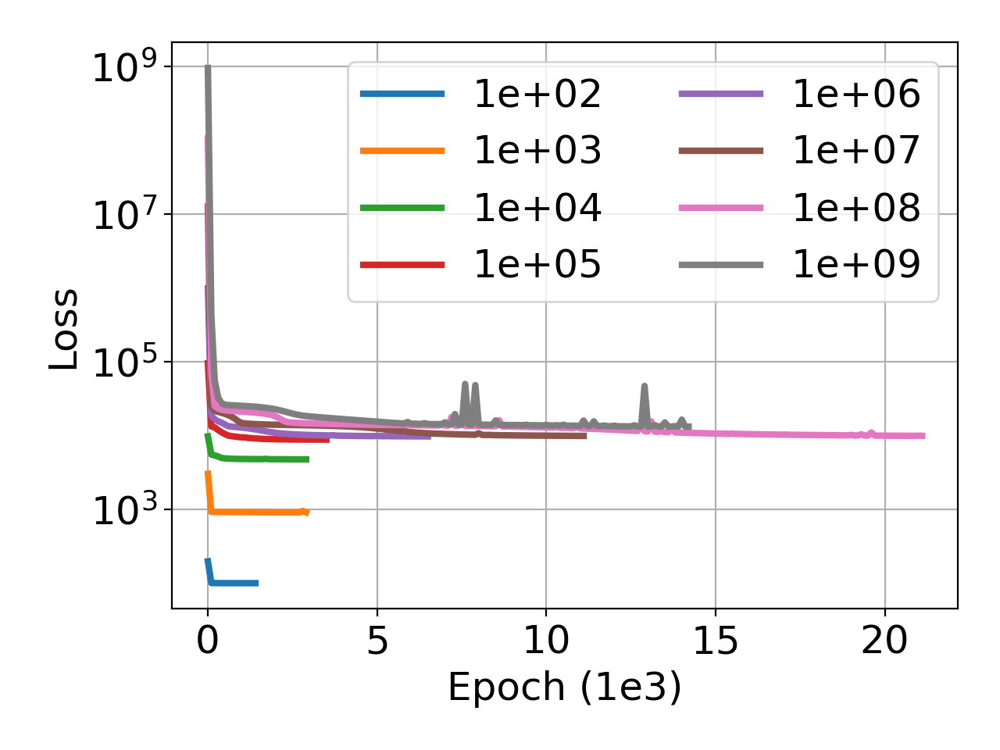
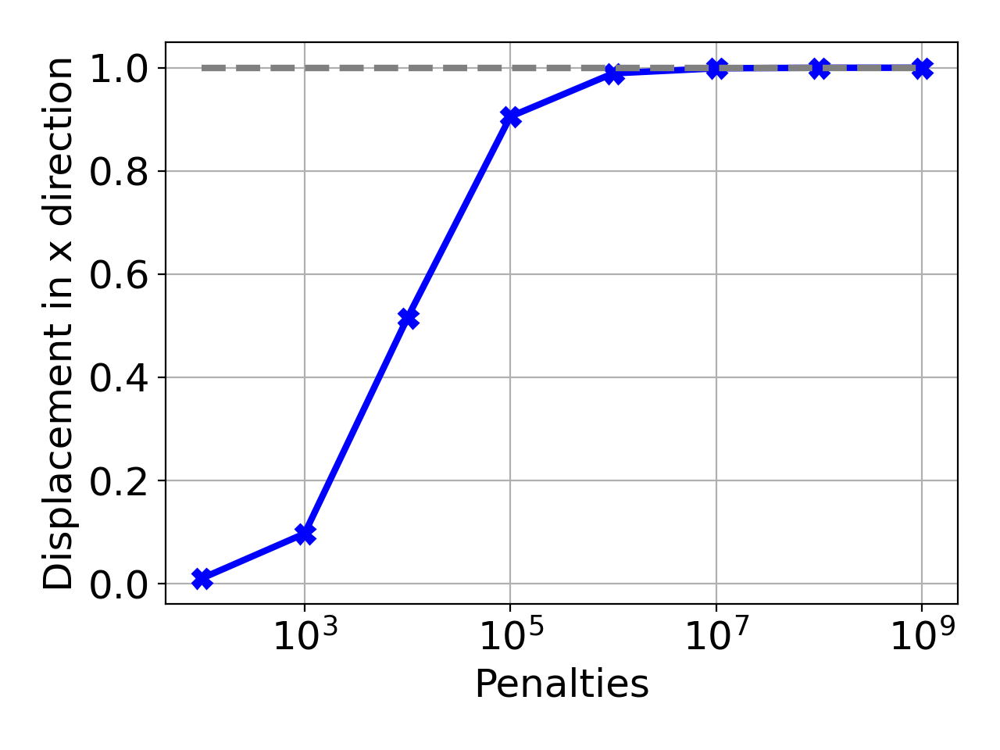
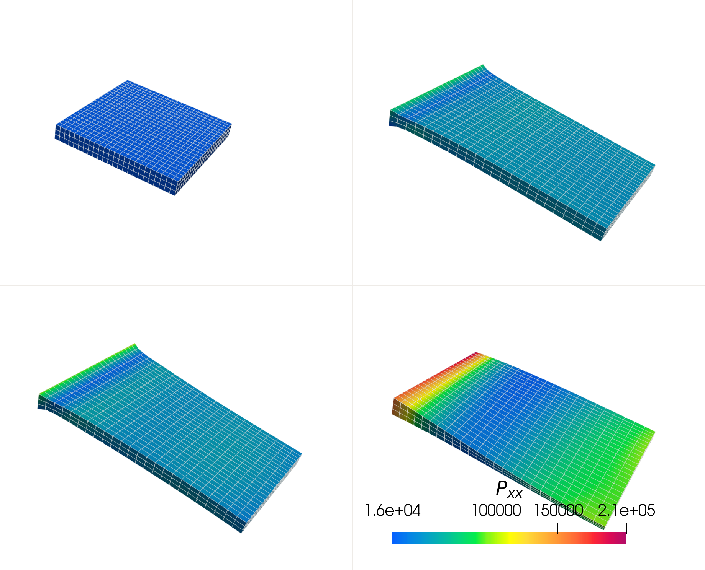

# DEM: Dirichlet boundary conditions.

## loading condition
The stratch is applied on the x direction and the value is:  
$$
\epsilon_x = \frac{dx}{lx_0} = 0.5
$$
The boundary conditions in the end of left side is applied by the distance function: 
$$
u(x) = NN(x) * x[:, 0]
$$

In the end of right side, the boundary conditions are applied through the penalty term in the loss function:  
$$
L_{\mathrm{Dirichlet}} = penalty\cdot\left(NN(x)[\mathrm{rightEndIndex}] - u[\mathrm{rightEndIndex}]\right)^2
$$

## values of the penalties
The values of penalty used are as following:
- 1e2
- 1e3
- 1e4
- 1e5
- 1e6
- 1e7
- 1e8
- 1e9

## parameters
- K_penalty = 500e3 # 60e3
- mu = 62.1e3 * 0.1
- c1 = 56.59e3
- c2 = 3.83
- health = 1.0  (totally healthy tissue)
- theta = 1.0
- phi = 0.0

## Results
As it is clear in the results, the penalty in the right hand side act as a spring to tract the right boundary to move to the pre-defined value (named the Dirichlet boundary conditions).
Thus the stiffness (Young's modulus) of the spring will surely influence the reults.
As is shown in the figure of training loss, the loss increases as the penalty coeficient increases. The training also becomes more difficult as the penalty coefficient increases.

The displacements are close to targeted value as the penalty coefficient increases to 1e6. If the penalty is not large enough, the Dirichlet boundary condition can not be accurately applied. 

| Fig. 1 Training loss | Fig. 2 Displacement in the right end |
| :-----------: | :-----------: |
|  |  |

If the penalty coefficient increases to 1e9, something interesting arises. As is shown in Figure 3, the deformation converges after the penalty coefficient reaches 1e6. But after, it reaches 1e9, the optimization results in a curved surface which is not rational.

| **Fig. 3 Deformed model** |
| :-----------: |
|   |

